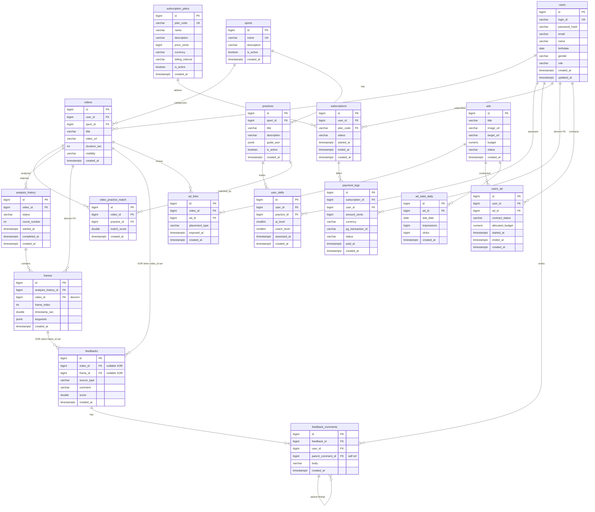
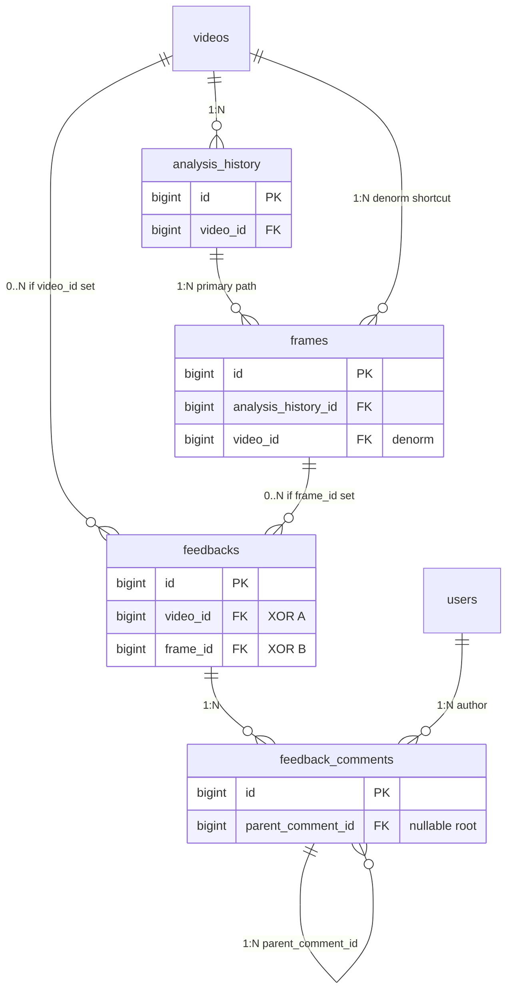

# Forma ERD (Entity Relationship Diagram)

관련 문서: [[_docs/CLAUDE]] · [[TITANIC_ERD]] · [[fastapi_project_context]]

> **DB:** Neon PostgreSQL · **테이블 수:** 17 (복수형 canonical name)  
> **마이그레이션:** `backend/apps/sports/migrations/` (`001` ~ `005`)  
> **최종 갱신:** 2026-06-05

---

## 1. 개요

Forma 도메인은 스포츠 영상 업로드·AI 분석·구독 결제·광고 운영을 담는 17개 테이블로 구성된다.

| # | 테이블 | 역할 | 앱 모듈 (코드) |
|---|--------|------|----------------|
| 1 | `sports` | 스포츠 종목 마스터 | admin |
| 2 | `users` | 사용자 정보 (Secom 공유) | sports |
| 3 | `videos` | 동영상 메타데이터 | sports |
| 4 | `analysis_history` | 영상 분석 회차·진행 상태 | vision |
| 5 | `frames` | 분석 프레임·키포인트 | vision |
| 6 | `feedbacks` | 시스템·코치 피드백 | vision |
| 7 | `feedback_comments` | 피드백 대댓글 | vision |
| 8 | `practices` | 종목별 권장 자세 카탈로그 | admin |
| 9 | `video_practice_match` | 영상 ↔ 연습 자세 매칭 | sports |
| 10 | `user_skills` | 유저별·자세별 숙련도 | sports |
| 11 | `subscription_plans` | 구독 플랜 마스터 | sports |
| 12 | `subscriptions` | 유저별 구독 인스턴스 | sports |
| 13 | `payment_logs` | 구독 결제 이력 | sports |
| 14 | `ads` | 광고·상품 메타데이터 | admin |
| 15 | `ad_links` | 영상별 광고 노출 이력 | sports |
| 16 | `users_ad` | 유저별 광고 계약·집행 | admin |
| 17 | `ad_stats_daily` | 일별 광고 노출·클릭 집계 | admin |

> **참고:** ERD는 DB 관점(17테이블)이고, 앱 모듈은 헥사고날 패키지 분리 기준이다. 모듈과 테이블이 1:1이 아닐 수 있다.

---

## 2. 관계 표기 원칙

### 2.1 식별 vs 비식별

| 구분 | Forma 스키마 |
|------|----------------|
| **식별 관계** | 없음 — 자식 PK에 부모 FK가 포함된 복합 PK 없음 |
| **비식별 관계** | **전 관계 해당** — 모든 테이블 PK = `BIGSERIAL id` 단독, FK는 일반 컬럼 |

`subscriptions.plan_code` → `subscription_plans.plan_code`처럼 **자연키(UK) FK**를 써도, `subscriptions.id`가 독립 PK이므로 **비식별**이다.

### 2.2 카디널리티 (Mermaid `erDiagram`)

| 표기 | 의미 |
|------|------|
| `\|\|--o{` | 부모 **1** : 자식 **0..N** (비식별 FK, 자식에 surrogate PK) |
| `\|\|--\|{` | 부모 **1** : 자식 **1..N** (Forma에서는 미사용) |
| `}o--o{` | **M:N** — Forma는 직접 M:N FK 없음, 연결 테이블로 분해 |

### 2.3 M:N → 연결(Associative) 테이블

| 개념적 M:N | 연결 테이블 | UK / 비고 |
|------------|-------------|-----------|
| `videos` ↔ `practices` | `video_practice_match` | `(video_id, practice_id)` |
| `users` ↔ `practices` | `user_skills` | `(user_id, practice_id)` + 숙련도 속성 |
| `users` ↔ `ads` | `users_ad` | `(user_id, ad_id)` + 계약 속성 |
| `users` ↔ `subscription_plans` | `subscriptions` | UK 없음 — **이력형** 인스턴스 (0..N 구독/유저) |
| `videos` ↔ `ads` | `ad_links` | UK 없음 — **이벤트 로그** (동일 쌍·다중 노출 허용) |

### 2.4 특수 관계 (다이어그램 주의)

| 관계 | 유형 | 설명 |
|------|------|------|
| `feedbacks` ↔ `videos` / `frames` | **배타적 XOR 1:N** | `video_id`와 `frame_id` 중 **정확히 하나만** NOT NULL (`004`) |
| `feedback_comments` → `feedback_comments` | **자기참조 1:N** | `parent_comment_id` 대댓글 스레드 |
| `frames.video_id` | **비정규화 FK** | `analysis_history` 경유로도 `videos`에 도달 가능; **교차 일치 DB 제약 없음** |
| `payment_logs.user_id` | **중복 FK** | `subscription_id` → `subscriptions.user_id`로 유도 가능; 조회 편의 |

---

## 3. 전체 ERD (Mermaid)

> **Mermaid 렌더링:** 관계·속성 라벨에 `"` `()` `/` 등을 넣으면 Obsidian·GitHub 미리보기에서 파싱 오류가 날 수 있다. 깨지면 라벨을 짧은 영문·한글 단어로 바꾸거나 §5 테이블 상세를 참고한다. (§4.2·§6 다이어그램 동일)



> **읽는 법:** `feedbacks`에 `videos`·`frames` 선이 둘 다 있어도, 한 row는 **둘 중 한쪽에만** 속한다 (XOR). `feedback_comments`의 self 선은 `parent_comment_id` 대댓글이다.

---

## 4. 도메인별 관계 요약

### 4.1 콘텐츠 · 연습

```
sports ──< practices
sports ──< videos >── users
practices ──< video_practice_match >── videos
practices ──< user_skills >── users
```

### 4.2 Vision (AI 분석 · 피드백)

```
videos ──< analysis_history ──< frames
         └── frames.video_id (비정규화, analysis_history.video_id와 교차 검증 없음)

videos ──< feedbacks          ┐ XOR: (video_id IS NULL) <> (frame_id IS NULL)
frames ──< feedbacks          ┘

feedbacks ──< feedback_comments >── users
feedback_comments ──< feedback_comments   (parent_comment_id → self, 0..N 대댓글)
```

#### Vision 상세 ERD (XOR · 자기참조)



**XOR 제약 (`004_apply_3nf_fixes.sql`):** 각 `feedbacks` row는 `video_id`·`frame_id` 중 **하나만** NOT NULL.

### 4.3 Billing (구독 · 결제)

```
subscription_plans ──< subscriptions >── users
subscriptions ──< payment_logs
users ──< payment_logs   (조회 편의용 중복 FK)
```

**데이터 적재 순서**

1. `subscription_plans` (플랜 마스터 선등록)
2. `subscriptions` (`plan_code` FK 충족)
3. `payment_logs`

### 4.4 Ads (광고)

```
ads ──< ad_links >── videos
ads ──< users_ad >── users
ads ──< ad_stats_daily
```

#### Ads · M:N vs 이벤트 로그

| 테이블 | M:N 성격 | UK | 해석 |
|--------|----------|-----|------|
| `users_ad` | 순수 연결 + 속성 | `(user_id, ad_id)` | 계약 1건 = row 1건 |
| `ad_links` | 이벤트 팩트 | 없음 | 동일 (video, ad)도 `exposed_at`마다 **N건** 가능 |

---

## 5. 테이블 상세

### 5.1 `users` (공유)

Secom 인증과 공유하는 사용자 테이블. 비즈니스 로그인 키는 `login_id` (DB 컬럼명은 레거시 `user_id`일 수 있음 — `001` 마이그레이션 참고).

| 컬럼 | 타입 | 제약 | 설명 |
|------|------|------|------|
| `id` | BIGSERIAL | PK | 내부 식별자 |
| `login_id` | VARCHAR | UK | 로그인 ID |
| `password_hash` | VARCHAR | NOT NULL | 비밀번호 해시 |
| `email` | VARCHAR | | 이메일 |
| `name` | VARCHAR | | 표시 이름 |
| `birthdate` | DATE | | 생년월일 (`004` 이후 DATE) |
| `gender` | VARCHAR | | 성별 |
| `role` | VARCHAR | | 권한 역할 |
| `created_at` | TIMESTAMPTZ | DEFAULT NOW() | |
| `updated_at` | TIMESTAMPTZ | DEFAULT NOW() | |

---

### 5.2 `sports`

| 컬럼 | 타입 | 제약 | 설명 |
|------|------|------|------|
| `id` | BIGSERIAL | PK | |
| `name` | VARCHAR(100) | UK, NOT NULL | 종목명 (야구, 축구 등) |
| `description` | VARCHAR(500) | | |
| `is_active` | BOOLEAN | DEFAULT TRUE | |
| `created_at` | TIMESTAMPTZ | DEFAULT NOW() | |

---

### 5.3 `videos`

| 컬럼 | 타입 | 제약 | 설명 |
|------|------|------|------|
| `id` | BIGSERIAL | PK | |
| `user_id` | BIGINT | FK → users | 업로더 |
| `sport_id` | BIGINT | FK → sports | 종목 |
| `title` | VARCHAR(200) | NOT NULL | |
| `video_url` | VARCHAR(1000) | NOT NULL | |
| `duration_sec` | INTEGER | | 재생 길이(초) |
| `visibility` | VARCHAR(20) | DEFAULT 'public' | public / private 등 |
| `created_at` | TIMESTAMPTZ | DEFAULT NOW() | |

---

### 5.4 `analysis_history`

영상 분석 **회차** 및 진행 상태.

| 컬럼 | 타입 | 제약 | 설명 |
|------|------|------|------|
| `id` | BIGSERIAL | PK | |
| `video_id` | BIGINT | FK → videos | |
| `status` | VARCHAR(20) | CHECK | `PENDING`, `SUCCESS`, `FAILED` |
| `round_number` | INTEGER | DEFAULT 1 | 분석 회차 |
| `started_at` | TIMESTAMPTZ | | |
| `completed_at` | TIMESTAMPTZ | | |
| `created_at` | TIMESTAMPTZ | DEFAULT NOW() | |

---

### 5.5 `frames`

| 컬럼 | 타입 | 제약 | 설명 |
|------|------|------|------|
| `id` | BIGSERIAL | PK | |
| `analysis_history_id` | BIGINT | FK → analysis_history | |
| `video_id` | BIGINT | FK → videos | 조회 편의용 비정규화 |
| `frame_index` | INTEGER | NOT NULL | 프레임 순번 |
| `timestamp_sec` | DOUBLE PRECISION | NOT NULL | 영상 내 시각(초) |
| `keypoints` | JSONB | | 포즈·키포인트 |
| `created_at` | TIMESTAMPTZ | DEFAULT NOW() | |

**관계:** `analysis_history` → `frames`가 **주 경로(1:N 비식별)**. `video_id`는 `analysis_history.video_id`와 논리적으로 같아야 하나 **DB 교차 FK 없음** (§2.4).

---

### 5.6 `feedbacks`

| 컬럼 | 타입 | 제약 | 설명 |
|------|------|------|------|
| `id` | BIGSERIAL | PK | |
| `video_id` | BIGINT | FK → videos, NULL 허용 | |
| `frame_id` | BIGINT | FK → frames, NULL 허용 | |
| `source_type` | VARCHAR(20) | DEFAULT 'system' | system / coach 등 |
| `comment` | VARCHAR(2000) | NOT NULL | |
| `score` | DOUBLE PRECISION | CHECK 0~100 | |
| `created_at` | TIMESTAMPTZ | DEFAULT NOW() | |

**3NF 제약 (`004_apply_3nf_fixes.sql`)**

```sql
CHECK ((video_id IS NULL) <> (frame_id IS NULL))
```

→ 타임라인(영상) 피드백 **또는** 프레임 단위 피드백 중 **정확히 하나**만 지정. ERD상 `videos`·`frames` 양쪽 선이 있어도 **배타적 XOR** (§4.2).

---

### 5.7 `feedback_comments`

| 컬럼 | 타입 | 제약 | 설명 |
|------|------|------|------|
| `id` | BIGSERIAL | PK | |
| `feedback_id` | BIGINT | FK → feedbacks | |
| `user_id` | BIGINT | FK → users | 작성자 |
| `parent_comment_id` | BIGINT | FK → self | 대댓글 |
| `body` | VARCHAR(2000) | NOT NULL | |
| `created_at` | TIMESTAMPTZ | DEFAULT NOW() | |

**자기참조 1:N:** `parent_comment_id` NULL = 루트 댓글, NOT NULL = 대댓글. `feedback_comments ||--o{ feedback_comments` (§3·§4.2).

---

### 5.8 `practices`

| 컬럼 | 타입 | 제약 | 설명 |
|------|------|------|------|
| `id` | BIGSERIAL | PK | |
| `sport_id` | BIGINT | FK → sports | |
| `title` | VARCHAR(200) | NOT NULL | |
| `description` | VARCHAR(1000) | | |
| `guide_json` | JSONB | | 자세 가이드 데이터 |
| `is_active` | BOOLEAN | DEFAULT TRUE | |
| `created_at` | TIMESTAMPTZ | DEFAULT NOW() | |

---

### 5.9 `video_practice_match`

| 컬럼 | 타입 | 제약 | 설명 |
|------|------|------|------|
| `id` | BIGSERIAL | PK | |
| `video_id` | BIGINT | FK → videos | |
| `practice_id` | BIGINT | FK → practices | |
| `match_score` | DOUBLE PRECISION | | AI 매칭 점수 |
| `created_at` | TIMESTAMPTZ | DEFAULT NOW() | |

**UK:** `(video_id, practice_id)`

---

### 5.10 `user_skills`

| 컬럼 | 타입 | 제약 | 설명 |
|------|------|------|------|
| `id` | BIGSERIAL | PK | |
| `user_id` | BIGINT | FK → users | |
| `practice_id` | BIGINT | FK → practices | |
| `ai_level` | SMALLINT | DEFAULT 0 | AI 평가 숙련도 |
| `coach_level` | SMALLINT | DEFAULT 0 | 코치 평가 숙련도 |
| `assessed_at` | TIMESTAMPTZ | DEFAULT NOW() | |
| `created_at` | TIMESTAMPTZ | DEFAULT NOW() | |

**UK:** `(user_id, practice_id)`

---

### 5.11 `subscription_plans` (구독 플랜 마스터)

플랜 **정의** 테이블. 유저 구독 인스턴스(`subscriptions`)와 분리.

| 컬럼 | 타입 | 제약 | 설명 |
|------|------|------|------|
| `id` | BIGSERIAL | PK | |
| `plan_code` | VARCHAR(50) | UK, NOT NULL | 비즈니스 플랜 코드 (예: `basic_monthly`) |
| `name` | VARCHAR(100) | NOT NULL | 표시명 |
| `description` | VARCHAR(500) | | |
| `price_cents` | BIGINT | CHECK ≥ 0 | 가격(원 단위 × 100 등 센트 환산) |
| `currency` | VARCHAR(3) | DEFAULT 'KRW' | |
| `billing_interval` | VARCHAR(20) | DEFAULT 'monthly' | monthly / yearly 등 |
| `is_active` | BOOLEAN | DEFAULT TRUE | 판매 중 여부 |
| `created_at` | TIMESTAMPTZ | DEFAULT NOW() | |

**마이그레이션:** `005_subscription_plans.sql`

**목표 스키마 (미구현 · TBD)**

| 컬럼 | 상태 | 비고 |
|------|------|------|
| `features_json` | TBD | 플랜별 기능·한도 JSON (명세에만 존재) |
| `billing_period` | → `billing_interval` | 명세 별칭, DB는 `billing_interval` 사용 |

---

### 5.12 `subscriptions` (유저별 구독 인스턴스)

| 컬럼 | 타입 | 제약 | 설명 |
|------|------|------|------|
| `id` | BIGSERIAL | PK | |
| `user_id` | BIGINT | FK → users | |
| `plan_code` | VARCHAR(50) | FK → subscription_plans.plan_code | **현재 구현** |
| `status` | VARCHAR(20) | DEFAULT 'active' | active / cancelled 등 |
| `started_at` | TIMESTAMPTZ | DEFAULT NOW() | |
| `ended_at` | TIMESTAMPTZ | | 해지·만료 시각 |
| `created_at` | TIMESTAMPTZ | DEFAULT NOW() | |

**FK (`005`):**

```sql
FOREIGN KEY (plan_code) REFERENCES subscription_plans (plan_code)
ON DELETE RESTRICT NOT VALID
```

**비즈니스 규칙 (앱 레이어):** 유저당 활성 구독 1건 조회 (`get_active_for_user`). DB UK는 없음.

**설계 메모 (목표 vs 현재)**

| 항목 | 목표 명세 | 현재 DB |
|------|-----------|---------|
| 플랜 참조 | `subscription_plan_id` (대리키 FK) | `plan_code` (자연키 FK) |
| 향후 마이그레이션 | `plan_code` 유지 + `subscription_plan_id` 추가 가능 | — |

---

### 5.13 `payment_logs`

| 컬럼 | 타입 | 제약 | 설명 |
|------|------|------|------|
| `id` | BIGSERIAL | PK | |
| `subscription_id` | BIGINT | FK → subscriptions | |
| `user_id` | BIGINT | FK → users | 조회 편의 (subscriptions 경유 가능) |
| `amount_cents` | BIGINT | NOT NULL | 결제 금액 |
| `currency` | VARCHAR(3) | DEFAULT 'KRW' | |
| `pg_transaction_id` | VARCHAR(100) | NOT NULL | PG사 거래 ID |
| `status` | VARCHAR(20) | DEFAULT 'pending' | pending / paid / failed 등 |
| `paid_at` | TIMESTAMPTZ | | |
| `created_at` | TIMESTAMPTZ | DEFAULT NOW() | |

> 결제 시점 금액은 `payment_logs.amount_cents`에 기록. 플랜 가격 변경과 무관하게 이력 보존.

**관계:** `users`·`subscriptions` 경유로 `user_id` 유도 가능 — **비식별 중복 FK** (§2.4).

---

### 5.14 `ads`

| 컬럼 | 타입 | 제약 | 설명 |
|------|------|------|------|
| `id` | BIGSERIAL | PK | |
| `title` | VARCHAR(200) | NOT NULL | |
| `image_url` | VARCHAR(1000) | | 배너 이미지 |
| `target_url` | VARCHAR(1000) | NOT NULL | 랜딩 URL |
| `budget` | NUMERIC(14,2) | DEFAULT 0 | 총 예산 |
| `status` | VARCHAR(20) | DEFAULT 'active' | |
| `created_at` | TIMESTAMPTZ | DEFAULT NOW() | |

---

### 5.15 `ad_links`

영상 재생 중 **실시간 노출** 이벤트 로그.

| 컬럼 | 타입 | 제약 | 설명 |
|------|------|------|------|
| `id` | BIGSERIAL | PK | |
| `video_id` | BIGINT | FK → videos | |
| `ad_id` | BIGINT | FK → ads | |
| `placement_type` | VARCHAR(30) | DEFAULT 'overlay' | |
| `exposed_at` | TIMESTAMPTZ | DEFAULT NOW() | |
| `created_at` | TIMESTAMPTZ | DEFAULT NOW() | |

**관계:** `videos`·`ads` 각각 1:N. UK 없음 — **M:N 이벤트 로그** (§4.4), 순수 정션 테이블 아님.

---

### 5.16 `users_ad`

유저 계정별 광고 **계약·집행** 관리.

| 컬럼 | 타입 | 제약 | 설명 |
|------|------|------|------|
| `id` | BIGSERIAL | PK | |
| `user_id` | BIGINT | FK → users | |
| `ad_id` | BIGINT | FK → ads | |
| `contract_status` | VARCHAR(20) | DEFAULT 'active' | |
| `allocated_budget` | NUMERIC(14,2) | DEFAULT 0 | |
| `started_at` | TIMESTAMPTZ | DEFAULT NOW() | |
| `ended_at` | TIMESTAMPTZ | | |
| `created_at` | TIMESTAMPTZ | DEFAULT NOW() | |

**UK:** `(user_id, ad_id)`

---

### 5.17 `ad_stats_daily`

실시간 `ad_links` 부담을 줄이기 위한 **일별 집계**.

| 컬럼 | 타입 | 제약 | 설명 |
|------|------|------|------|
| `id` | BIGSERIAL | PK | |
| `ad_id` | BIGINT | FK → ads | |
| `stat_date` | DATE | NOT NULL | |
| `impressions` | BIGINT | DEFAULT 0 | |
| `clicks` | BIGINT | DEFAULT 0 | |
| `created_at` | TIMESTAMPTZ | DEFAULT NOW() | |

**UK:** `(ad_id, stat_date)`

---

## 6. 구독 도메인 상세 다이어그램

```mermaid
erDiagram
    subscription_plans ||--o{ subscriptions : "plan_code"
    users ||--o{ subscriptions : "user_id"
    subscriptions ||--o{ payment_logs : "subscription_id"
    users ||--o{ payment_logs : "user_id"

    subscription_plans {
        bigint id PK
        varchar plan_code UK "비즈니스 키"
        bigint price_cents "마스터 가격"
        varchar billing_interval
    }

    subscriptions {
        bigint id PK
        varchar plan_code FK "→ subscription_plans.plan_code"
        varchar status "active|cancelled|..."
    }

    payment_logs {
        bigint id PK
        bigint amount_cents "결제 시점 스냅샷"
        varchar pg_transaction_id UK_candidate
    }
```

### API (현재)

| Method | Path | 설명 |
|--------|------|------|
| GET | `/forma/subscription-plans` | 플랜 목록 |
| POST | `/forma/subscription-plans` | 플랜 등록 |
| GET | `/forma/users/{user_id}/subscription` | 활성 구독 조회 |
| POST | `/forma/users/{user_id}/subscription` | 구독 생성 |
| POST | `/forma/subscriptions/{subscription_id}/payment-logs` | 결제 기록 |

---

## 7. 마이그레이션 이력

| 파일 | 내용 |
|------|------|
| `001_forma_schema.sql` | 16테이블 초기 스키마 (subscription_plans 제외) |
| `002_drop_singular_duplicate_tables.sql` | 단수형 중복 테이블 제거 |
| `003_align_plural_tables.sql` | 복수형 테이블명 정렬 |
| `004_apply_3nf_fixes.sql` | feedbacks XOR, users.birthdate DATE, ad_stats_daily UK |
| `005_subscription_plans.sql` | subscription_plans 추가, subscriptions FK |

---

## 8. 향후 ERD 갱신 체크리스트

- [ ] `subscription_plans.features_json` 컬럼 추가 시 §5.11 갱신
- [ ] `subscriptions.subscription_plan_id` 대리키 FK 전환 시 §5.12·§6 갱신
- [ ] `frames.video_id` ↔ `analysis_history.video_id` 교차 일치 TRIGGER/CHECK 추가 시 §4.2·§5.5 갱신
- [ ] `subscriptions` 활성 1건 UK를 DB에 둘지 여부 결정
- [ ] `payment_logs.pg_transaction_id` UNIQUE 여부
- [ ] `users` ORM `birthdate` 타입을 DATE로 코드 정합

---

## 9. 관련 코드 경로

| 구분 | 경로 |
|------|------|
| SQL 마이그레이션 | `backend/apps/sports/migrations/` |
| sports 모듈 모델 | `backend/apps/sports/app/models/` |
| admin 모듈 모델 | `backend/apps/admin/app/models/` |
| vision 모듈 모델 | `backend/apps/vision/app/models/` |
| Forma API 라우터 | `backend/apps/sports/app/forma_routes.py` |
